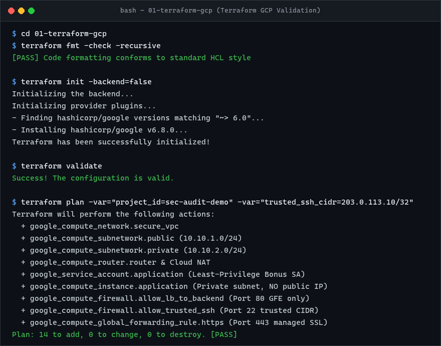

# Secure GCP Infrastructure with Terraform

## Design

```text
Internet
   |
   | HTTPS :443
   v
Global External HTTPS Load Balancer
   |
   | HTTP :80
   v
Backend Service
   |
   v
Private Compute Engine VM
10.10.2.x
   |
   +-- no external IP
```

The Compute Engine instance is kept in the private subnet and does not receive a public IP. The load balancer provides the public application entry point.

In Google Cloud, the global external HTTP(S) load balancer frontend terminates at Google Front Ends (GFEs) globally rather than as a subnet-bound VM. The VPC subnets host the backend workload and internal network paths.

## Firewall model

- **Public HTTPS (443)**: In Google Cloud, Global External HTTP(S) Load Balancer frontends terminate at Google Front Ends (GFEs) outside VPC subnets. VPC firewall rules apply only to VM virtual interfaces within the VPC, not to Global Forwarding Rules. External public access is therefore governed by the port 443 forwarding rule (`google_compute_global_forwarding_rule.https`) with TLS termination via Google-managed SSL. (Cloud Armor security policies can be attached for Layer 7 WAF / edge IP filtering).
- **Backend HTTP (80)**: Restricted by the `allow-load-balancer-to-backend` firewall rule exclusively to Google Cloud load balancer proxy and health-check source CIDRs (`35.191.0.0/16` and `130.211.0.0/22`). Direct internet access to the backend is blocked.
- **SSH (22)**: Restricted by the `allow-trusted-ssh` firewall rule to a trusted CIDR variable (`var.trusted_ssh_cidr`), with an explicit Terraform variable validation condition rejecting `0.0.0.0/0`.
- **HTTP (80) Forwarding Rule**: Included purely to implement standard HTTP-to-HTTPS redirect (`MOVED_PERMANENTLY_DEFAULT`) to enforce secure transit without exposing an unencrypted backend.

For production, I would normally prefer Identity-Aware Proxy (IAP) for TCP forwarding (`35.235.240.0/20`), VPN, or another controlled management path instead of direct SSH exposure.

## Workload Identity & Least-Privilege IAM

- Rather than relying on the default Compute Engine service account (which is granted `roles/editor`), the instance is attached to a dedicated custom service account (`app-workload-sa`).
- Minimal IAM roles (`roles/logging.logWriter` and `roles/monitoring.metricWriter`) are granted for observability without granting lateral movement or cloud administrator capabilities.

## Deploy & Validation

### Using Native Terraform CLI:
```bash
terraform init -backend=false
terraform fmt -check -recursive
terraform validate
terraform plan -var='project_id=PROJECT_ID' -var='trusted_ssh_cidr=X.X.X.X/32'
terraform apply -var='project_id=PROJECT_ID' -var='trusted_ssh_cidr=X.X.X.X/32'
```

### Using Docker (when terraform is not installed on host PATH):
```bash
# If running from within 01-terraform-gcp directory:
docker run --rm -v "${PWD}:/workspace" -w /workspace hashicorp/terraform:latest fmt -check -recursive
docker run --rm -v "${PWD}:/workspace" -w /workspace hashicorp/terraform:latest validate
```

### Execution & Verification Results



Do not commit real project IDs, credentials or Terraform state containing sensitive values.
