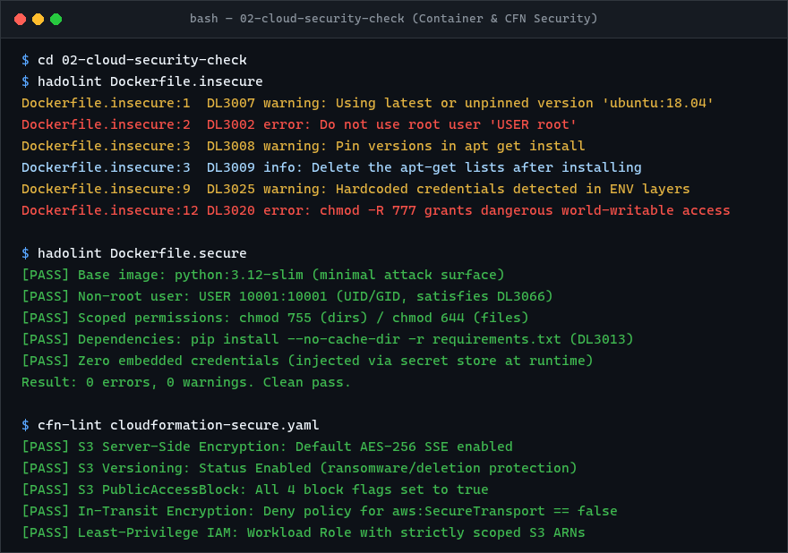

# Cloud Security Check

## CloudFormation findings

The supplied template ([`cloudformation-insecure.yaml`](cloudformation-insecure.yaml)) has several security issues:

1. The IAM policy grants `Action: "*"` and `Resource: "*"`, which is unrestricted account-level permission.
2. It creates a long-lived IAM user rather than using a role and temporary credentials for a workload.
3. There is no MFA requirement represented in the template.
4. The S3 bucket has no explicit encryption, versioning or public-access-block configuration.
5. There is no bucket policy shown to enforce TLS-only access.

The remediation is implemented in [`cloudformation-secure.yaml`](cloudformation-secure.yaml), using roles with only the actions and resources the workload needs and hardening the S3 bucket.

## Existing-environment detection

For an existing AWS environment I would combine:

- IAM Access Analyzer
- AWS Config
- AWS Security Hub
- CloudTrail
- IaC scanning with cfn-lint, cfn-guard or Checkov

For the specific wildcard policy, I would inspect CloudTrail and IAM usage information before removing permissions, then replace the policy through the normal change/deployment process.

## Docker findings

The supplied Dockerfile:

- Uses an obsolete Ubuntu base image.
- Runs as root.
- Stores database credentials and an API key in the image definition.
- Installs unnecessary packages.
- Uses `chmod -R 777`.
- Copies the whole build context without a `.dockerignore`.
- Does not pin or verify application dependencies.
- Has no explicit container health or runtime hardening.

The hardened example runs as a non-root user, uses a smaller current Python base image, removes embedded secrets and avoids world-writable permissions.

## Prevention strategies

To prevent these misconfigurations from reaching development or production environments:

### 1. Infrastructure as Code (CloudFormation) Prevention
- **CI/CD Static Analysis**: Enforce pre-commit hooks and pipeline gates using `cfn-lint`, `cfn-guard`, or `checkov` to block templates with wildcard actions (`Action: *`, `Resource: *`) or unencrypted S3 buckets.
- **Service Control Policies (SCPs)**: Implement AWS Organizations SCPs that prevent the creation of IAM users without attached permissions boundaries, and deny S3 bucket creation without default encryption.
- **AWS S3 Account-Level Public Access Block**: Enable S3 Block Public Access at the AWS account level to prevent public bucket policies globally.
- **CloudFormation Guard / OPA**: Define policy-as-code rules requiring explicit TLS enforcement (`aws:SecureTransport: "false"` denial) on all S3 bucket policies.

### 2. Container (Dockerfile) Prevention
- **Container Linting Gate**: Integrate `hadolint` into the CI/CD pipeline (as configured in `.github/workflows/security-checks.yml`) to fail builds on root users (`USER root`), missing `--no-cache-dir`, or permissive file permissions.
- **Secret Scanning**: Run automated secret scanners (`gitleaks`, `trufflehog`, or GitHub Secret Scanning) to prevent building images containing credentials like `DB_PASSWORD` or `API_KEY`.
- **Vulnerability Scanning**: Scan container images during the build stage using `Trivy`, `Grype`, or AWS ECR basic/enhanced scanning to reject base images with critical/high CVEs.
- **Kubernetes / ECS Admission Control**: Enforce runtime security policies (via OPA Gatekeeper, Kyverno, or AWS ECS task definition constraints) requiring `runAsNonRoot: true` and read-only root filesystems.

---

## Execution & Verification Results

