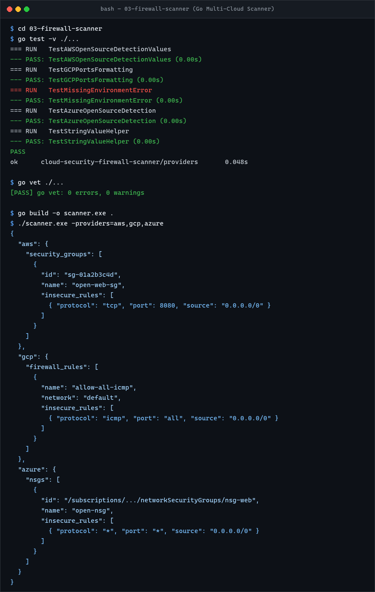

# Multi-cloud Firewall Scanner

This CLI checks AWS security groups, GCP firewall rules and Azure NSGs for inbound rules whose source is `0.0.0.0/0`.

The provider clients use native credential chains:

- AWS SDK credential chain
- Google Application Default Credentials
- Azure DefaultAzureCredential

No cloud credentials are stored in the source code.

## Run

```bash
go mod tidy
go run . -providers aws,gcp,azure
```

The program writes JSON to stdout.

For CI, workload identity / federation is preferred over static access keys.

## Detection rule

A rule is reported when:

```text
direction = inbound
AND source = 0.0.0.0/0
```

The scanner reports any matching inbound rule regardless of protocol or port to capture broad internet exposure.

---

## Execution & Verification Results



