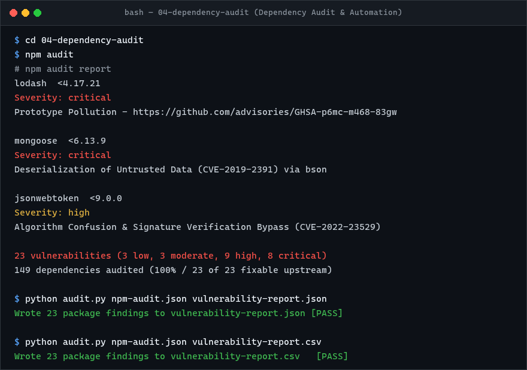

# Third-Party Dependency Security Audit

## Audit Overview

A dependency vulnerability audit was conducted on `package.json` by resolving the full package tree with `npm audit` and generating structured JSON and CSV reports with `audit.py`.

- **Total Dependencies Audited**: 149 packages (128 production, 21 dev).
- **Total Detected Vulnerabilities**: **23 vulnerabilities**
  - **Critical**: 8
  - **High**: 9
  - **Moderate**: 3
  - **Low**: 3

---

## Execution & Automation

Run the dependency audit and generate structured JSON and CSV reports:

```bash
cd 04-dependency-audit
npm install
npm audit --json > npm-audit.json

# Generate JSON report
python3 audit.py npm-audit.json vulnerability-report.json

# Or generate CSV report
python3 audit.py npm-audit.json vulnerability-report.csv
```

---

## Critical & High Vulnerability Findings

| Package | Severity | Type | Key Advisories / CVEs | Remediation |
| :--- | :--- | :--- | :--- | :--- |
| **`lodash`** | **Critical** | Direct | Prototype Pollution (GHSA-p6mc-m468-83gw, CVE-2019-10744, CVE-2020-8203) | Upgrade to `lodash@^4.17.21` |
| **`mongoose`** | **Critical** | Direct | Transitive critical BSON/MongoDB deserialization and injection | Upgrade to `mongoose@^8.x` or `>=6.13.9` |
| **`bson`** | **Critical** | Transitive (via mongoose) | Deserialization of Untrusted Data (CVE-2019-2391, GHSA-4jwp-vfvf-657p) | Resolved by updating `mongoose` |
| **`mongodb`** / **`mongodb-core`** | **Critical** | Transitive (via mongoose) | Buffer exposure & arbitrary code execution | Resolved by updating `mongoose` |
| **`mocha`** | **Critical** | Direct (dev) | Transitive prototype pollution via `minimist` & `mkdirp` | Upgrade to `mocha@^10.x` or `>=12.0.2` |
| **`minimist`** | **Critical** | Transitive (via mocha) | Prototype Pollution (CVE-2020-7598, GHSA-vh95-rmgr-6w4m) | Resolved by updating `mocha` |
| **`mkdirp`** | **Critical** | Transitive (via mocha) | Legacy unsupported version with potential command injection | Resolved by updating `mocha` |
| **`jsonwebtoken`** | **High** | Direct | Algorithm confusion & insecure verification (CVE-2022-23529, CVE-2022-23540) | Upgrade to `jsonwebtoken@^9.0.2` |
| **`express`** | **High** | Direct | Multiple transitive ReDoS and DoS vulnerabilities in parsers | Upgrade to `express@^4.21.0` |
| **`qs`** | **High** | Transitive (via express) | Denial of Service via unhandled arrayLimit bypass & prototype bypass | Resolved by updating `express` |
| **`send`** | **High** | Transitive (via express) | Regular Expression Denial of Service (ReDoS) | Resolved by updating `express` |
| **`path-to-regexp`** | **High** | Transitive (via express) | Regular Expression Denial of Service (ReDoS) | Resolved by updating `express` |
| **`async`** | **High** | Transitive (via mongoose) | Prototype Pollution (GHSA-fwr7-v2mv-hh25) | Resolved by updating `mongoose` |

---

## Remediation Roadmap & Fix Availability

- **Total Fixable Issues**: **23 out of 23 (100%)** of the vulnerabilities have upstream security patches available.
- **Breaking Changes Note**: Because the dependencies in the supplied `package.json` are several major versions behind (e.g., `express 4.15.0`, `mongoose ^4.2.4`, `jsonwebtoken 8.1.0`), remediation requires major version bumps:
  1. `npm audit fix --force` will upgrade packages to non-vulnerable versions.
  2. For production stability, manual migration of breaking API changes (such as Mongoose 4.x -> 8.x async/await query changes and Express route parser middleware) should be planned in sprints with automated test coverage.

---

## Execution & Verification Results


